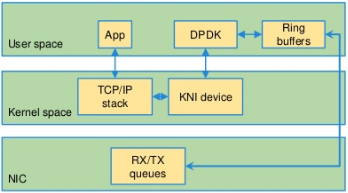

# DPDK与内核交互

DPDK与内核的交互，依赖`kni`模块，结构如下图所示：

例程`kni`演示了DPDK与内核协议栈的交互。

## `kni模块`的初始化过程

`/dev/kni`是一个字符设备，在`lib/librte_eal/linuxapp/kni/kni_misc.c:kni_init()`中，调用`misc_register()`函数创建。
字符设备对外提供`ioctl`接口，有三个命令：`RTE_KNI_IOCTL_TEST`,`RTE_KNI_IOCTL_CREATE`和`RTE_KNI_IOCTL_RELEASE`。

在`lib/librte_kni/rte_kni.c`中，对`/dev/kni`模块提供的接口，做了进一步的封装。

## 与`kni模块`的交互过程

